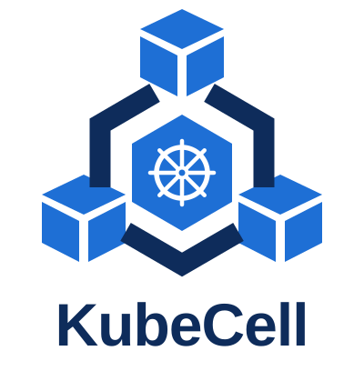

<p align="center">
  
</p>

# KubeCell

[](https://kubecell.openrepos.org/)

Provision isolated Kubernetes child clusters (`VirtualCluster`) on shared physical hosts.

KubeCell is a Kubernetes Operator built with Kubebuilder. A single management cluster holds the desired state; each Cell host cluster runs the workloads. Developers get a standard `kubectl`-compatible child K3s API with hard quota isolation, TopoLVM storage, and unified accelerator semantics.


> [!NOTE]
> KubeCell is in progress and not stable for now, do not use it for production.

## Features

- **Four CRDs, nothing more**: `Cell`, `VirtualNodeClass`, `VirtualClusterPlan`, `VirtualCluster` under `kubecell.io/v1alpha1`.
- **Intent-only specs**: you declare which Cell and which quota class to use; platform constants (versions, ports, reservations, security baselines) never enter the CRDs.
- **Dry-run preflight**: `VirtualClusterPlan` evaluates feasibility (`Accepted` / `Rejected` / `Unknown`) without side effects.
- **Management-only writes**: the controller writes OCM `ManifestWork` and reads hosts through the OCM proxy. It never connects directly to a host.
- **Hard isolation**: per-child host namespace with `ResourceQuota`, `LimitRange`, `NetworkPolicy`, and admission rejection of privileged/host access and `hostPath` volumes.
- **One logical node**: each child cluster exposes exactly one logical node named `kubelet`. Scale by switching quota classes, not by adding nodes.
- **Pinned stack**: host K3s, K3k, child K3s, and OCM Hub versions are locked and verified by the installer.

## Architecture

```text
Management cluster (single, desired-state only)
├── OCM Hub and extensions
├── KubeCell management controller + CRD webhook (kubecell-management chart)
├── KubeCell installer (release-bundle orchestration, one-shot privileged actions)
└── Cell / VirtualNodeClass / VirtualClusterPlan / VirtualCluster CRs
    └── OCM ManifestWork
        ▼
Cell host cluster (one Cell = one OCM ManagedCluster = one host cluster)
├── OCM klusterlet and work-agent
├── K3k shared-mode controller
├── Host baseline installed by the installer at pinned versions: CNI/CoreDNS, K3k, TopoLVM, Traefik, Device Plugin
└── Physical host nodes (same profile, all counted as inventory)
    └── Reflected workload Pods and PVCs
        ▼
VirtualCluster (child K3s)
├── Child K3s API server and control plane
├── Exactly one logical child node (always named `kubelet`)
└── Child admin kubeconfig (always published)
```

The management cluster only declares intent and reads observations. It runs no tenant workloads. KubeCell ships no second scheduler, device allocator, CSI driver, or host communication proxy.

## Quickstart

Human-authored specs express intent only. Fields with a single safe value are platform constants (see `technical-design.md`).

```yaml
# Cell: bind one ManagedCluster and declare its single machine profile.
# Generated by the installer from live discovery; you only apply it.
apiVersion: kubecell.io/v1alpha1
kind: Cell
metadata:
  name: cell1
  namespace: kubecell-system
spec:
  managedClusterRef:
    name: cell1
  machineProfile:
    name: ascend-910b
    devices:
    - name: ascend
      resourceName: huawei.com/Ascend910
```

```yaml
# VirtualNodeClass: one name maps to one quota tier.
apiVersion: kubecell.io/v1alpha1
kind: VirtualNodeClass
metadata:
  name: ascend-910b
spec:
  entitlement:
    workloadHard:
      requests.cpu: "4"
      limits.cpu: "4"
      requests.memory: 8Gi
      limits.memory: 8Gi
      requests.huawei.com/Ascend910: "2"
      limits.huawei.com/Ascend910: "2"
  storageClassName: topolvm-provisioner
```

```yaml
# VirtualCluster: daily creation is eight lines.
apiVersion: kubecell.io/v1alpha1
kind: VirtualCluster
metadata:
  name: child-dev
  namespace: kubecell-system
spec:
  cellRef: {name: cell1}
  classRef: {name: ascend-910b}
```

Create a `VirtualClusterPlan` with the same content first for a side-effect-free preflight, then read the admin kubeconfig from the Secret referenced by `status.credential.secretName`.

## Locked Combination and Key Constraints

| Component | Version / Requirement |
| --- | --- |
| Management cluster | Single-node K3s (version may differ from hosts) |
| Cell host Kubernetes | K3s `v1.36.3+k3s1` |
| K3k | `v1.2.0` |
| Child K3s | Public surface `v1.34.2+k3s1` |
| Architectures | Management x86_64; hosts validated on ARM64 |
| Accelerators | Example `huawei.com/Ascend910` with generic extended-resource semantics, no vendor branches |
| Storage | Provisioner runs on hosts only (TopoLVM); child `hostPath` volumes are always rejected with a replacement hint |
| Logical nodes | Exactly one per child cluster (always `kubelet`); DaemonSet-style semantics are unsupported |
| External exposure | Host Traefik owns `:80` / `:443`; hostnames look like `<ingress>.<vc>.<apps-suffix>`; v1 supports HTTP(S) only |
| Interaction | `logs`, valid `exec`, `attach`; `port-forward` is not guaranteed |

## Installation

Order (`technical-design.md`): apply CRDs -> install OCM Hub -> install management chart -> host `join` -> manually approve `ManagedCluster` -> install host chart -> install host baseline -> verify Cell baseline -> create Class/Plan/child cluster.

```sh
# Read-only preflight (default is read-only; --dry-run only prints)
go run ./cmd/kubecell-installer doctor management --bundle /path/to/kubecell-release
go run ./cmd/kubecell-installer doctor host --bundle /path/to/kubecell-release
# Management plane (execution requires both --apply and --confirm)
go run ./cmd/kubecell-installer management --bundle /path/to/kubecell-release --apply --confirm
# Host: join and chart are two steps with manual approval in between
go run ./cmd/kubecell-installer host --bundle /path/to/kubecell-release --step=join --apply --confirm
clusteradm accept --clusters <managed-cluster-name>
go run ./cmd/kubecell-installer host --bundle /path/to/kubecell-release --step=chart --apply --confirm
```

> [!TIP]
> Generate the Cell from live discovery (`host --step=cell`) and draft quota tiers with `suggest-class`. See `docs/operations/host-onboarding.md` for the four-command flow.

The installer only touches the selected KubeCell release. OCM Hub, `ManagedCluster`, and klusterlet follow the OCM lifecycle and are out of Helm uninstall scope.

## Management UI: Kite Dashboard

The `kubecell-management` chart bundles the kite-org dashboard as a conditional dependency (`kite.enabled`, on by default) for viewing Cell and child-cluster CRs. It runs single-node with sqlite, exposes a NodePort Service, and uses a dedicated ServiceAccount. Pass the initial superuser password at install time; never commit it. See `technical-design.md` for the RBAC trade-off.

## Testing and CI

- Local gates on every commit: `make manifests generate`, `go test ./...`, envtest, chart lint/template.
- Full online runs: see `docs/testing/ci-plan.md` (uninstall + register and install + feature matrix + evidence; the management cluster is singular and every online step runs as a production operation).
- Track bugs through GitHub issues with reproduction steps, expected versus actual behavior, and related resources.

## Troubleshooting (General)

- Cell not Ready: check OCM `ManagedCluster` `Joined` / `Available`, then host lease freshness, then Cell conditions. `Available=True` alone is not trusted.
- Work not Applied: check the `ManifestWork` status in the target ManagedCluster namespace, then the host work-agent and target namespace. Writing directly to hosts is not supported.
- Child API unreachable: check `status.endpoint` and the published Secret endpoint, then host K3k Service/Server Pods/PVCs and TopoLVM.
- Image pull failures: fix registry reachability and OCI-archive transfer first (helpers in `hack/image/`), record digests and architectures.

## Cleanup

Delete the owning `VirtualCluster` to remove a child cluster (Finalizer-scoped cleanup by UID; under `Retain`, PVs become Released and data is preserved). Uninstalling a Helm release is not the same as uninstalling OCM.

## Website

The public landing page and documentation site live in `website/`. It is an English, statically
exported [vinext](https://github.com/cloudflare/vinext) app built with shadcn/ui and Magic UI, and
deployed to Cloudflare Pages with Wrangler.

```sh
cd website
pnpm install
pnpm dev        # http://localhost:3001
pnpm build      # static export to dist/client
pnpm deploy     # wrangler pages deploy (project: kubecell)
```

`.github/workflows/website.yml` typechecks, builds, and deploys the site on pushes to `main` that
touch `website/**`. See `website/README.md` for Cloudflare secrets and content conventions.

## Documentation Map

- `technical-design.md`: authoritative behavior, APIs, dependencies, and operational assumptions.
- `TODOS.md`: roadmap and milestone exits.
- `docs/operations/host-onboarding.md`: host onboarding in four commands.
- `docs/testing/ci-plan.md`: CI layers and the full reinstall loop.
- `docs/environment.example.md`: template for local lab notes (`docs/environment.md` itself is gitignored).
- `hack/release/README.md`: release-bundle workflow.
- `website/README.md`: public website structure, SEO setup, and Pages deployment.

## Project Layout

```text
api/                  CRD types and validation
cmd/                  management controller, host webhook, installer
internal/             controllers, rendering, admission, providers, platform constants
config/               Kubebuilder manifests (CRDs, RBAC, webhook, manager)
charts/               kubecell-management and kubecell-host Helm charts
third-party/          pinned upstream versions (e.g. OCM)
hack/                 image and release helpers
test/                 envtest, chart contracts, manifest guards, e2e scaffolding
docs/                 operations and testing guides plus the logo
website/              public landing page and documentation site (Cloudflare Pages)
technical-design.md   single source of truth
```
